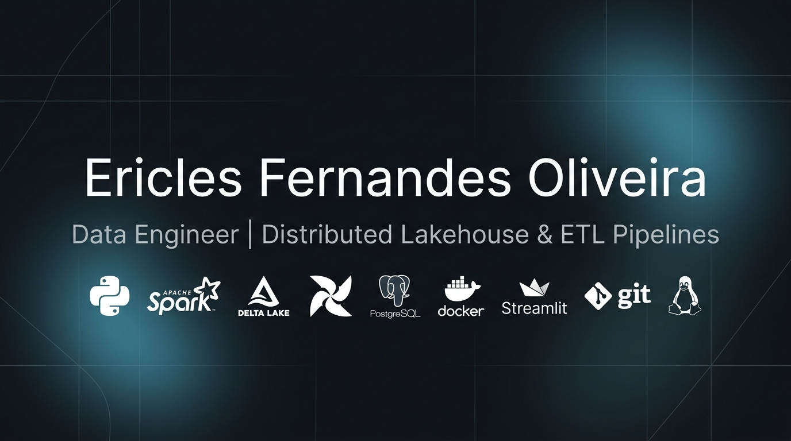

  

  
  
  

  *(Bilingual Profile: <a href="#-português">Português</a> | <a href="#-english">English</a>)*

---

## 🇧🇷 Português

Engenheiro de Dados focado no desenvolvimento de plataformas de dados escaláveis, resilientes e orientadas a valor analítico. Especialista na implementação da **Arquitetura Medalhão** (Bronze ➔ Silver ➔ Gold), processamento distribuído massivo em **PySpark**, armazenamento colunar ACID em **Delta Lake**, modelagem dimensional **Star Schema (Kimball)** em nuvem e orquestração automatizada com **Apache Airflow 3**.

---

### 🛠️ Tech Stack & Tecnologias

---

### ⚡ Projetos em Destaque (Produção)

1. 🏥 **[HealthTech Data Lakehouse](https://github.com/loweri/healthtech-lakehouse)**
   - Plataforma de inteligência hospitalar e cuidados críticos (UTI) sob a **Arquitetura Medalhão**.
   - Ingestão Bronze com Schema Enforcement estrito (`StructType`), processamento distribuído em **PySpark** na Silver (tempo de permanência e custos clínicos) e modelagem **Star Schema Kimball** na Gold.
   - Orquestração em lote via **Apache Airflow 3** (54s), suíte de testes com **Pytest** e painel executivo interativo em **Streamlit & Plotly**.

2. 🚀 **[Financial Data Lakehouse Distribuído](https://github.com/loweri/datalake-pyspark)**
   - Plataforma de Data Lakehouse para cotações do mercado global (B3 e Nasdaq) com **Delta Lake** colunar ACID e *Partition Pruning*.
   - Engenharia de indicadores técnicos (Médias Móveis 21d/200d) via **PySpark** e orquestração automatizada no **Apache Airflow 3**.

3. 📊 **[Financial ETL Pipeline & Cloud Data Warehouse](https://github.com/loweri/financial-etl-pipeline)**  
   *🌐 [Acesse o Dashboard Interativo ao Vivo](https://financial-etl-dw.streamlit.app)*
   - Pipeline ETL automatizado consumindo APIs financeiras com tratamento universal de fusos horários (UTC).
   - Data Warehouse na nuvem (**Supabase / PostgreSQL**) modelado em **Star Schema** com garantia de carga idempotente (`ON CONFLICT DO UPDATE`).

4. 📜 **[Compendium: Codex do Engenheiro de Dados](https://github.com/loweri/codexv1)**  
   *🌐 [Acesse o App PWA no Ar](https://loweri.github.io/codexv1/)*
   - Aplicação Web progressiva (PWA 100% offline) gamificada para gestão de aprendizado contínuo em Engenharia de Dados.

---

## 🇺🇸 English

Data Engineer focused on building scalable, resilient, and business-driven data platforms. Specialized in the **Medallion Architecture** (Bronze ➔ Silver ➔ Gold), massive distributed computing with **PySpark & Delta Lake (ACID + Time Travel)**, cloud-based **Kimball Star Schema** dimensional modeling, and workflow orchestration via **Apache Airflow 3**.

---

### ⚡ Featured Production Projects

1. 🏥 **[HealthTech Data Lakehouse](https://github.com/loweri/healthtech-lakehouse)**
   - Clinical intelligence and ICU capacity lakehouse powered by the **Medallion Architecture**.
   - Strict Schema Enforcement (`StructType`), distributed feature engineering in **PySpark**, and **Kimball Star Schema** analytical modeling in **Delta Lake**.
   - Orchestrated with **Apache Airflow 3** (54s runtime), tested via **Pytest**, and monitored with an executive **Streamlit & Plotly** dashboard.

2. 🚀 **[Distributed Financial Data Lakehouse](https://github.com/loweri/datalake-pyspark)**
   - Global market data lakehouse with **PySpark** and **Delta Lake ACID** transaction logging with partition pruning.
   - Fully automated DAG pipeline in **Apache Airflow 3** and validated through isolated **Pytest** Spark fixtures.

3. 📊 **[Financial ETL Pipeline & Cloud Data Warehouse](https://github.com/loweri/financial-etl-pipeline)**  
   *🌐 [Live Interactive Dashboard](https://financial-etl-dw.streamlit.app)*
   - Automated financial ETL pipeline on **Supabase / PostgreSQL** with **Kimball's Star Schema** and production **Streamlit** dashboard.

4. 📜 **[Compendium: Data Engineer's Codex](https://github.com/loweri/codexv1)**  
   *🌐 [Live PWA Application](https://loweri.github.io/codexv1/)*
   - Progressive Web App (PWA 100% offline) gamifying continuous technical progression in Data Engineering.

---

### 📫 Conecte-se comigo / Connect with me:

